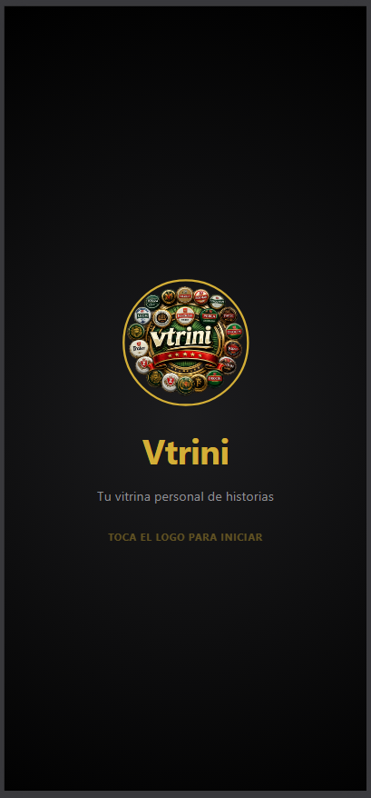
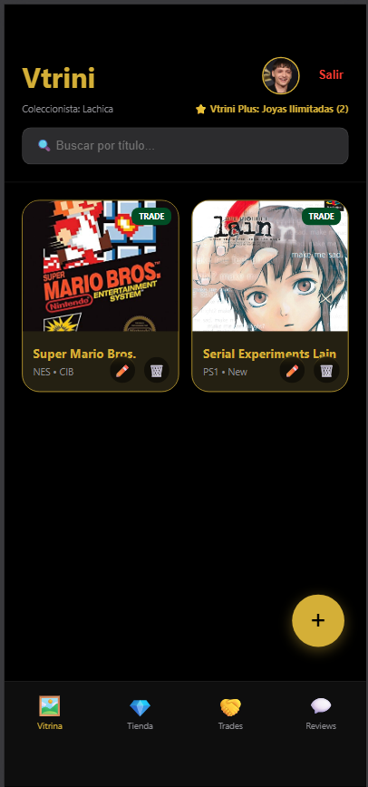
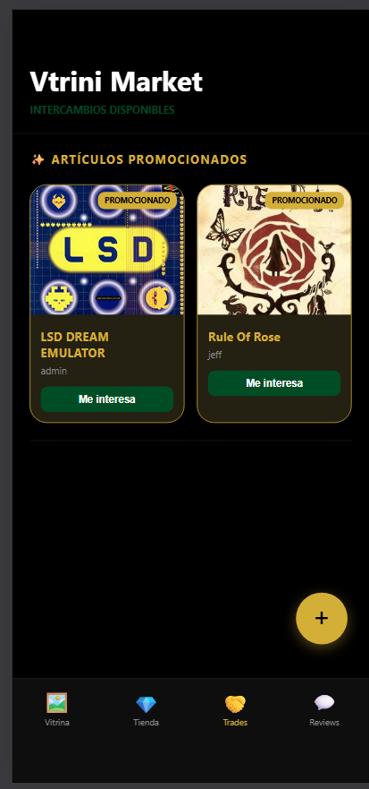

# Vtrini 🎮
**Tu vitrina personal de historias**

Aplicación web mobile-first para coleccionistas de videojuegos. Gestiona tu inventario, evita compras duplicadas e intercambia con otros coleccionistas.

---

## Screenshots

<div align="center">

| Splash | Vitrina | Marketplace |
|--------|---------|-------------|
|  |  |  |

</div>

---

## Funcionalidades

- **Galería Digital** — Registra tus videojuegos con foto, estado de conservación, edición y notas personales
- **Prevención de duplicados** — Consulta tu inventario antes de comprar en tienda física
- **Vtrini Market** — Intercambia coleccionables con otros usuarios de la plataforma
- **Tienda / Vtrini Plus** — Suscripción premium para joyas ilimitadas y personalización avanzada
- **Autenticación segura** — Login con Firebase Authentication

---

## Stack Tecnológico

| Capa | Tecnología |
|------|------------|
| Frontend | HTML · CSS · JavaScript |
| Base de datos | Cloud Firestore |
| Autenticación | Firebase Authentication |
| Almacenamiento de imágenes | Firebase Cloud Storage |

---

## Estructura del Proyecto

```
vtrini/
├── index.html
├── css/
├── js/
└── assets/
```

---

## Instalación y Uso

1. Clona el repositorio:
   ```bash
   git clone https://github.com/lachicawired/vtrini.git
   ```
2. Configura tu proyecto Firebase en `js/firebase-config.js`
3. Abre `index.html` en tu navegador o despliega en Firebase Hosting

---

## Desarrollado en

CECyTE Baja California — Plantel Mexicali  
Carrera: Técnico en Programación · 2026
